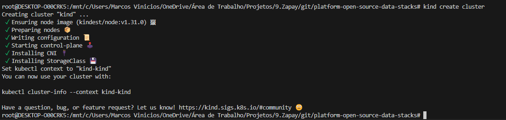

# Setup Kind (Kubernetes in Docker)

## Pré-requisitos

- Docker
- Kubectl
- Curl

## Instalação

```bash
curl -Lo ./kind "https://kind.sigs.k8s.io/dl/latest/kind-linux-amd64"
chmod +x ./kind
sudo mv ./kind /usr/local/bin/kind
```

## Verificando a instalação

```bash
kind --version
```

## Criando um cluster

```bash
kind create cluster
```


